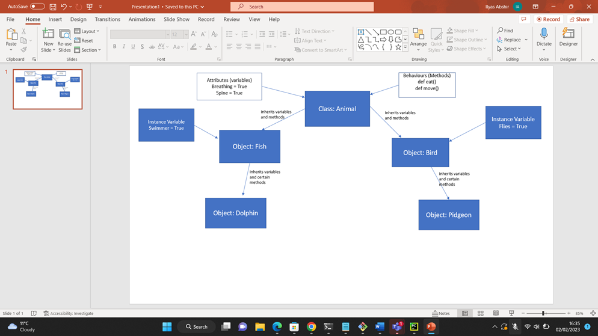

# tech201_oop

## What is OOP?

-Object Oriented means directed towards objects. In other words, it means functionally 
directed towards modelling objects. This is one of the many techniques used for modelling 
complex systems by describing a collection of interacting objects via their data and 
behavior.
Python, an Object Oriented programming (OOP), is a way of programming that focuses 
on using objects and classes to design and build applications. Major pillars of Object 
Oriented Programming (OOP) are Inheritance, Polymorphism, Abstraction, ad 
Encapsulation.



## What are the four pillars of OOP?


### Abstraction
This property allows us to hide the details and expose only the essential features of a 
concept or object. For example, a person driving a scooter knows that on pressing a horn, 
sound is emitted, but he has no idea about how the sound is actually generated on pressing 
the horn.

````python
class Animal:

    def __init__(self):
        self.alive = True
        self.spine = True
        self.eyes = True
        self.lungs = True

    def breathe(self):
        print("One breath in one breath out")

    def eat(self):
        print("Nom Nom Nom")

    def procreate(self):
        print("Find a mate")

    def move(self):
        print("Onwards and upwards")

cat = Animal()
cat.breathe()
```` 

### Inheritance
Inheritance, also called generalization, allows us to capture a hierarchal relationship 
between classes and objects. For instance, a ‘fruit’ is a generalization of ‘orange’. 
Inheritance is very useful from a code reuse perspective.

````python
from animal import Animal #caps let's pyhton know you want class

class Reptile(Animal):  #Reptile inherits from animal variables. Can also add reptile specific things

    def __init__(self):
        super().__init__() #inheriting from animal. Initialize animal first before reptile.
        self.cold_blooded = True
        self.tetrapod = None
        self.heart_chambers = [3, 4]
        self.amniotic_eggs = None


    def seek_heat(self):
        print("It's chilly outside, where is the sun")

    def hunt(self):
        print("Wait, wait, wait... pounce")

    def use_venom(self):
        print("If I have got it, I am going to use it")

    def attract_through_scent(self):
        print("Time to spray some eut de toilette")

jeremy_the_reptile = Reptile()

jeremy_the_reptile.tetrapod
jeremy_the_reptile.hunt()
jeremy_the_reptile.procreate()
jeremy_the_reptile.move()

```` 

### Encapsulation
This property hides unnecessary details and makes it easier to manage the program 
structure. Each object’s implementation and state are hidden behind well-defined 
boundaries and that provides a clean and simple interface for working with them. One way 
to accomplish this is by making the data private.
````python
from reptile import Reptile

class Snake(Reptile):

    def __init__(self):
        super().__init__()
        self.forked_tongue = True
        self.venom = None
        self.limbs = False

    def use_tongue_to_smell(self):
        print("Do I say it smells or tastes nice?")

sidney = Snake()
sidney.seek_heat()
sidney.limbs
#Encapsulation is about hiding it via another file. Functions hidden cant access.


```` 


### Polymorphism
Poly-morphism means many forms. That is, a thing or action is present in different forms
or ways. One good example of polymorphism is constructor overloading in classes.

````python
from snake import Snake

class Python(Snake):

    def __init__(self):
        super().__init__()
        self.large = True
        self.two_lungs = True
        self.venom = False

    def digest_large_prey(self):
         print("Ok let me get stretchy pants")
    def constrict(self):
         print("Squeeeze")
    def shed_skin(self):
         print("I'm growing now.")
    def climb(self):
         print("up we go")

peter = Python()

peter.hunt()
peter.shed_skin()

```` 


## What are benefits of using OOP?
Python was designed with an object-oriented approach. OOP offers the following 
advantages: 
- Provides a clear program structure, which makes it easy to map real world problems
and their solutions.
- Facilitates easy maintenance and modification of existing code.
Enhances program modularity because each object exists independently and new 
features can be added easily without disturbing the existing ones.
- Presents a good framework for code libraries where supplied components can be 
easily adapted and modified by the programmer.
- Imparts code reusabilit
